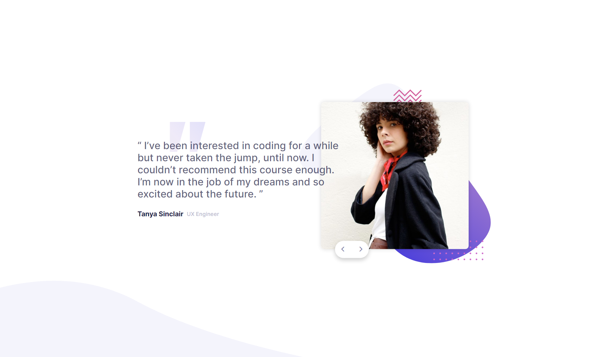

# Frontend Mentor - Coding bootcamp testimonials slider solution

This is a solution to the [Coding bootcamp testimonials slider challenge on Frontend Mentor](https://www.frontendmentor.io/challenges/coding-bootcamp-testimonials-slider-4FNyLA8JL). Frontend Mentor challenges help you improve your coding skills by building realistic projects. 

## Table of contents

- [Overview](#overview)
  - [The challenge](#the-challenge)
  - [Screenshot](#screenshot)
  - [Links](#links)
- [My process](#my-process)
  - [Built with](#built-with)
  - [What I learned](#what-i-learned)
  - [Continued development](#continued-development)
  - [Useful resources](#useful-resources)
- [Author](#author)
- [Acknowledgments](#acknowledgments)

## Overview

### The challenge

Users should be able to:

- View the optimal layout for the component depending on their device's screen size
- Navigate the slider using either their mouse/trackpad or keyboard

### Screenshot



### Links

- Solution URL: [Add solution URL here](https://your-solution-url.com)
- Live Site URL: https://pyaethein.github.io/Coding-Bootcamp-Testimonials-Slider/

## My process

### Built with

- Semantic HTML5 markup
- CSS custom properties
- Flexbox
- CSS Grid
- Mobile-first workflow
- SCSS
- Vanilla JavaScript

### What I learned

- creating a slider using `transform: translateX()` in JavaScript

```css
.testimonials{
  /* placed before slider */
  overflow: hidden; 
}
```
```js
const tab = document.querySelector('.testimonials__slider'),
btn = document.querySelectorAll('.testimonials__btn');

btn[0].onclick = function() {
  tab.style.transform = 'translateX(0%)';
}

btn[1].onclick = function() {
  tab.style.transform = 'translateX(-100%)';
}

btn[2].onclick = function() {
  tab.style.transform = 'translateX(0%)';
}

btn[3].onclick = function() {
  tab.style.transform = 'translateX(-100%)';
}
```

### Continued development

I still need to learn how to create a slider that can bring back to the beginning when we still click on next button.

### Useful resources

- https://www.youtube.com/watch?v=fzgLWi40-2g - This youtube tutorial helped me build a simple testimonials slider.

## Author

- Frontend Mentor - (https://www.frontendmentor.io/profile/pyaetheiN)
- Twitter - (https://www.twitter.com/pt_boyyy)

## Acknowledgments

https://www.youtube.com/channel/UCkjoHfkLEy7ZT4bA2myJ8xA - Easy Tutorials